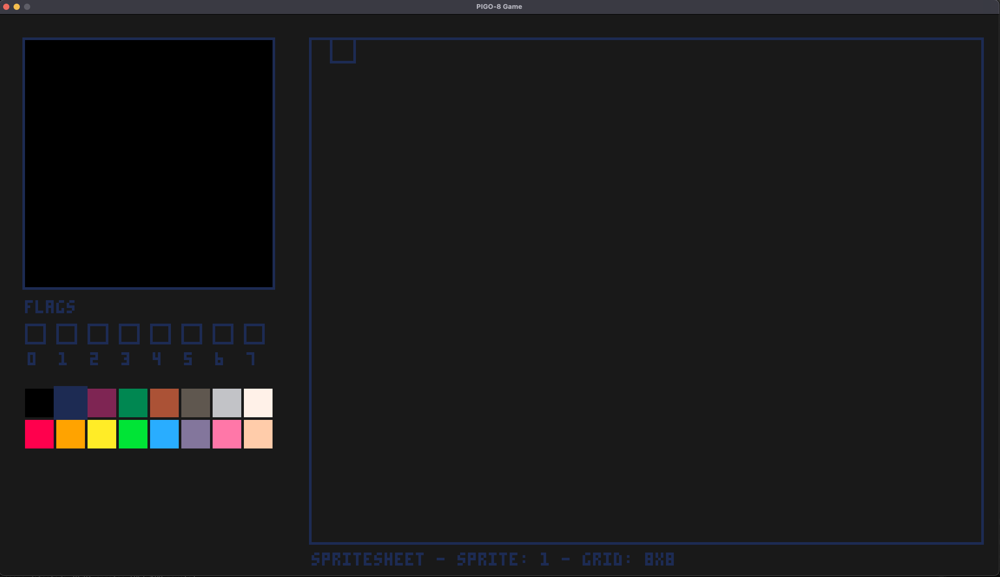
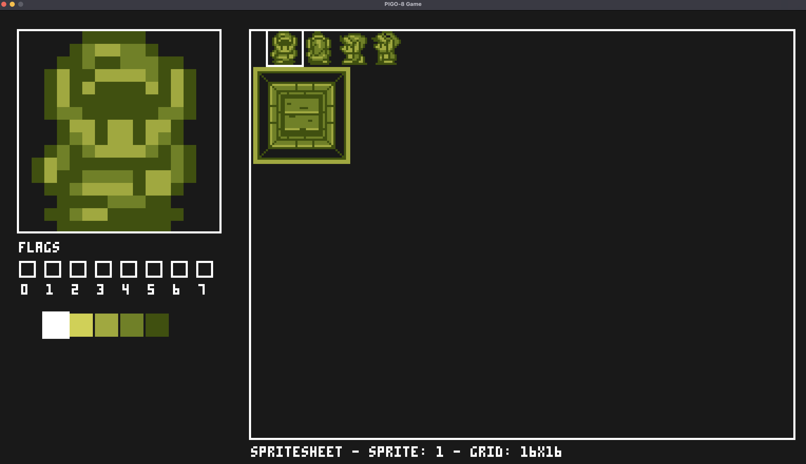
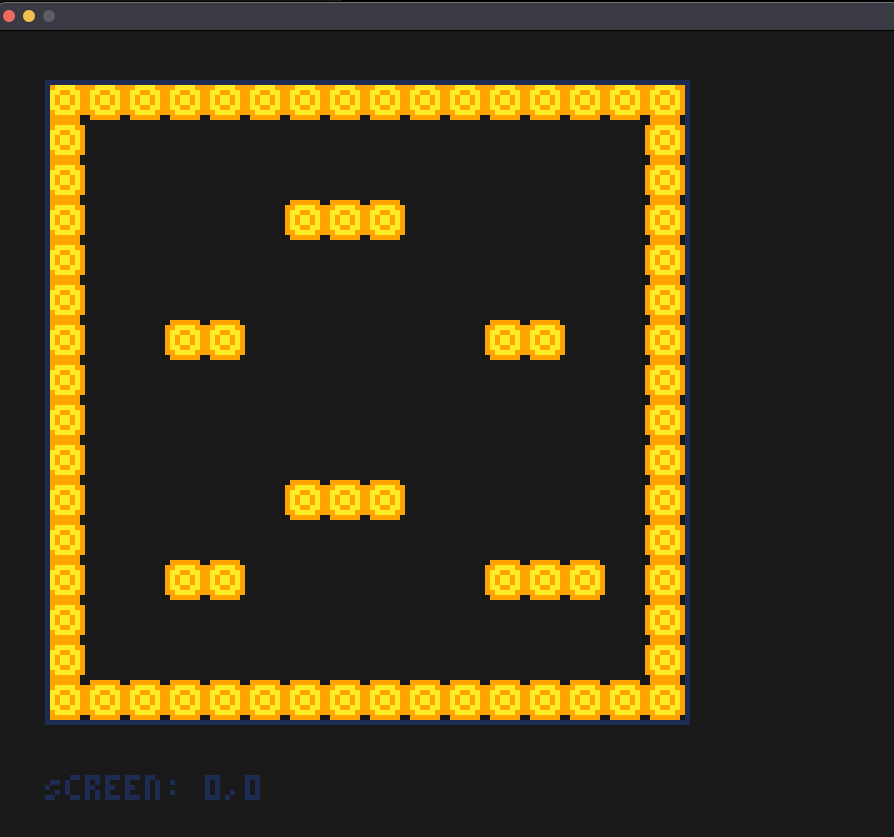

# PIGO8 Editor

The PIGO8 editor is an _extremely minimal_ tool that allows you to create and edit sprites and maps for your PIGO8 games. This documentation covers how to install, run, and use the editor effectively.

## Installation

To install the PIGO8 editor, you need to have Go installed on your system. If you haven't installed Go yet, please refer to the [Installing Go](installing_go.md) guide.

Once Go is installed, you can install the PIGO8 editor with the following command:

```bash
go install github.com/drpaneas/pigo8/cmd/editor@latest
```

This will download and compile the editor, making it available as a command-line tool in your system.

## Running the Editor

After installation, you can run the editor with the following command:

```bash
editor
```

By default, the editor will open with the standard PICO-8 resolution (128x128). However, you can customize the window size using the `-w` and `-h` flags:

```bash
editor -w 640 -h 480
```

This will open the editor with a window size of 640x480 pixels, giving you more screen space to work with.

## Editor Interface

The editor has two main modes:

1. **Sprite Editor**: For creating and editing individual sprites
2. **Map Editor**: For arranging sprites into a game map

### Switching Between Modes

You can switch between the sprite editor and map editor by pressing the `X` key on your keyboard. The current mode is displayed at the top of the editor window.

## Sprite Editor



The sprite editor allows you to create and modify individual sprites pixel by pixel. Each sprite is 8x8 pixels in size, matching the PICO-8 standard.

### Multi-Sprite Editing

The editor supports multi-sprite editing with different grid sizes. You can toggle between grid sizes using the `mouse wheel`:

* 8x8 (1 sprite)
* 16x16 (4 sprites in a 2x2 grid)
* 32x32 (16 sprites in a 4x4 grid)



This feature allows you to work on larger sprites or sprite collections as a single unit, with proper mapping to the corresponding individual sprites.

### Sprite Flags

Each sprite can have up to 8 flags (Flag0-Flag7) that can be used for game logic (like collision detection, animation states, etc.). You can toggle these flags in the editor interface.

When working with multi-sprite selections, flag changes apply to all selected sprites, with visual indication of mixed flag states when not all selected sprites have the same flag value.

## Map Editor



The map editor allows you to arrange sprites into a game map. You can select sprites from your spritesheet and place them on the map grid.

## Saving and Loading

The editor automatically saves your work to the following files:

* `spritesheet.json`: Contains all your sprites
* `map.json`: Contains your map data

These files are compatible with the PIGO8 library and can be loaded directly into your games.

## Keyboard Shortcuts

| Key | Function |
|-----|----------|
| `x` | Switch between Sprite Editor and Map Editor |
| `Mouse Wheel` | Change grid size in Sprite Editor |

In Map Editor you can switch between screens using the `arrow keys`.

The editor autosaves your work every time you switch between Sprite Editor and Map Editor.

## Command Line Options

| Flag | Description | Default |
|------|-------------|---------|
| -w | Window width in pixels | 128 |
| -h | Window height in pixels | 128 |

## Example Usage

```bash
# Run editor with default settings
editor

# Run editor with custom window size
editor -w 640 -h 480
```

## Next Steps

After creating your sprites and maps with the editor, you can use them in your PIGO8 games. See the [Resource Embedding](embedding.md) guide for details on how to include these resources in your game.
