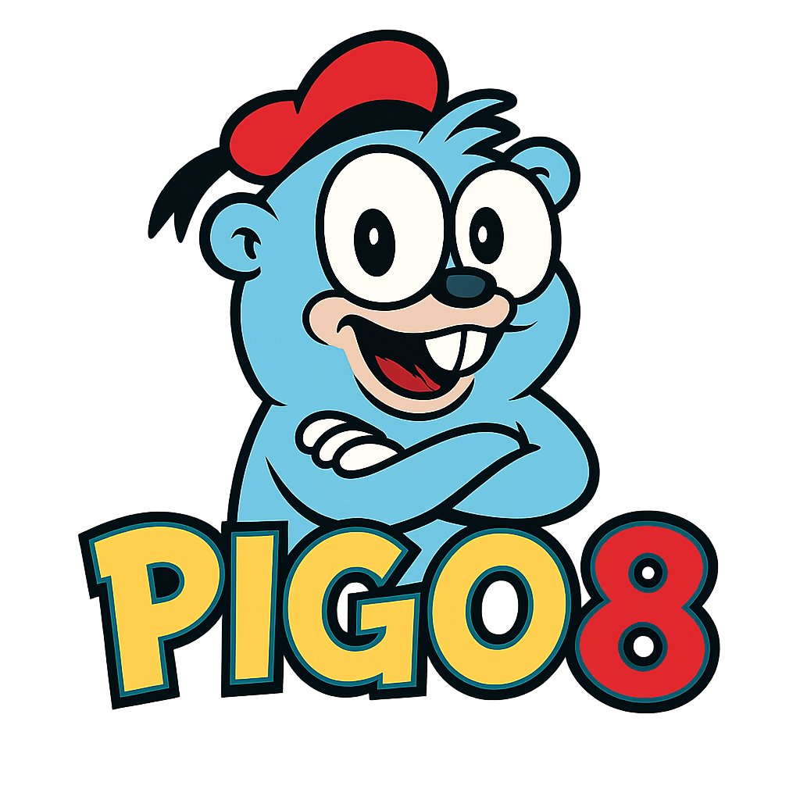

# Introduction

**PIGO8 Documentation** is your guide to building retro-styled games for the PICO-8 fantasy console using the power of **Go**.
With a simple API, minimal setup, and a dose of old-school charm, PIGO8 bridges modern Go programming with the nostalgic appeal of PICO-8.

> This documentation is evolving as the library matures. Expect updates and improvements as new features are added.

## What is PIGO8?

PIGO8 is a Go library designed to help you create games that run on the PICO-8 virtual console. It abstracts the lower-level technical details while keeping the distinctive PICO-8 aesthetic intact. Whether you're looking to prototype a game or build a full-featured project, PIGO8 offers the tools to bring your vision to life.

With PIGO8 you can:

* 🚀 Develop games using a clean and straightforward Go API
* 🎮 Leverage the retro charm of PICO-8 while benefiting from modern development practices
* 🛠 Integrate seamlessly with Go’s tooling and ecosystem

## Why Use Go for PICO-8 Development?

PICO-8 is a wonderful fantasy console with its own Lua-based game engine, but once your ideas outgrow the 128×128 constraint you may want to move to a general-purpose language.
Go is a simple, fast, modern language – and thanks to the pigo8 library you can actually port PICO-8 code almost line-for-line.

Go is known for its simplicity, speed, and efficiency. By using Go as your development language, PIGO8 empowers you to:

* Write concise and maintainable code without sacrificing performance
* Utilize robust tooling for testing, building, and deployment
* Adopt modern programming patterns in an environment inspired by classic gaming

## What’s in This Documentation?

This guide covers everything you need to get started with PIGO8, including:

* Setting up your development environment
* Creating and managing sprites and assets
* Building and deploying your PICO-8 games
* Tips and tricks for optimizing your retro game projects

Whether you're a seasoned Go developer or new to the PICO-8 scene, this documentation aims to help you start building games quickly and confidently.

## Who Is This Documentation For?

This book is intended for:

* Developers interested in retro game development with Go
* Go enthusiasts looking to explore the PICO-8 creative space
* Hobbyists or indie game developers eager to experiment with a blend of modern and vintage technologies

## Helpful Links

* [PIGO8 GitHub Repository](https://github.com/drpaneas/pigo8) – main development repo
* [PICO-8 Official Site](https://www.lexaloffle.com/pico-8.php) – learn more about the fantasy console
* [Go Documentation](https://golang.org/doc/) – resources to get started with Go

Dive in and explore the exciting possibilities with PIGO8 – where modern Go meets classic PICO-8 creativity!
